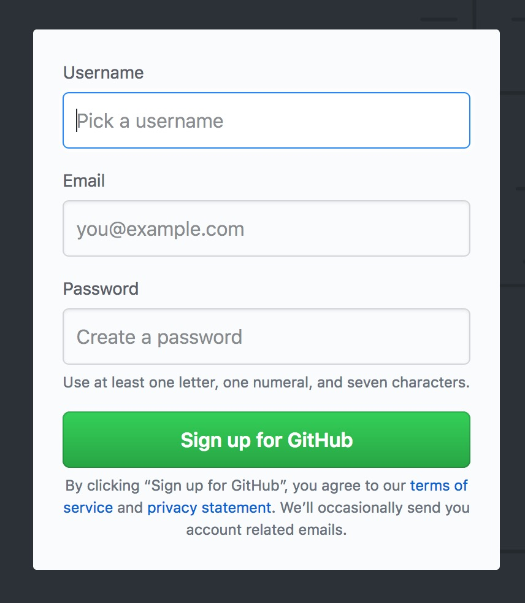

# Git-and-GitHub-101

## Objectives

After completing this unit you will be able to:

* Explain what the terms _source code management_ and _revision control_ system mean.
* Explain the purpose of _Git_ and _GitHub_ and what makes them different.
* Create up an account on GitHub.
* Explain what a _Git [repository][]_ is.
* Create a new git _repository_ on GitHub.
* Use git to:
  - **[clone][]** a repository that you want to work on.
  - **[add][]** a file so that it is tracked by git.
  - **[commit][]** a set of changes to you have made.
  - **[push][]** your changes to GitHub.
  - **[pull][]** the latest changes from GitHub.
  - check the **[status][]** of a project under git.
  - view a **[log][]** of changes made to the project.
  - see **[diff][]**&#8203;erences between versions of files you are working on.

Once you have mastered these skills you will have the basics of using git to manage a personal project and by maintaining your repository on GitHub you will be able to easily work on a project at home and at school. You will also be ready to "level up" to use git in team projects.

What separates using git on your own from work in a team project is the possibility of _merge conflicts_ – conflicts between changes that you have made and those made by someone else on the project team. The essential skills for using git as a member of a team are:

1. Avoiding merge conflicts, and
2. Resolving merge conflicts.

To avoid merge conflicts you first try to avoid having multiple people working on the same files, and use the Git **[branch][]** and **[merge][]** facilities to manage potential conflicts.

[add]: <https://git-scm.com/docs/git-add>
[branch]: <https://git-scm.com/docs/git-branch>
[clone]: <https://git-scm.com/docs/git-clone>
[commit]: <https://git-scm.com/docs/git-commit>
[diff]: <https://git-scm.com/docs/git-diff>
[log]: <https://git-scm.com/docs/git-log>
[merge]: <https://git-scm.com/docs/git-merge>
[pull]: <https://git-scm.com/docs/git-pull>
[push]: <https://git-scm.com/docs/git-push>
[repository]: <https://guides.github.com/introduction/git-handbook/#repository>
[status]: <https://git-scm.com/docs/git-status>

## Git / GitHub Skills

Managing versions and changes on a multi-user project can become very complex, good "git hygine" helps a lot, but it is still very possible to make a big mess in a hurry...

Attention to detail and practicing (a lot) will go a long way to developing a solid set of skills that will add depth to your resume. We'll take this is bite size chunks so that it doesn't get too overwhelming.

### Setting up an account on GitHub

If you don't already have one, the first step is to create an account on [GitHub][]. Click on the link, you'll be greated by a sign-up form like this:

Take the time to come up with a good username - your first and last name is a good choice – if you continue in computer science your GitHub account is likely to be a source of connections and also a feature on your resume. You don't want to be embarrased by your username. You also want your teacher to be able to recognize your account.

Use an e-mail account that you have access to. You will need to use it to verify your account. A working e-mail is also necessary to reset your password.

Make sure to choose a password that you will not forget. Note that they **do not** ask you to verify your password. Make sure that you have it right! You may want to type it in the clear and the cut and paste it into the form.

### Working online

In addition to hosting Git repositories for you, GitHub also makes it possible to browse its public repositories (and the private ones that you have access to) and edit the files in your repositories.

The GitHub Guide [Hello World][hello-world] is the good place to start learning how to work with Git and to collaborate with others through GitHub.

You're on your way! The next step is to learn about creating what GitHub calls a _fork_. Forks are copies of someone else's repository. In GitHub's workflow you collaborate on projects by creating a fork, modifying the code, and then finally making a _pull request_ to have your code merged into the original.

Work throgh the GitHub Guide [Forking Projects][forking] to learn how to create and work with forks. You can skip the _cloning_ step and make your changes online for now. We will learn about working locally (with files that reside on your computer in the next section).

### Using Git on the command online

### Using Git from IntelliJ

## Branches, Code Reviews, and Merge Conflicts

[forking]: <https://guides.github.com/activities/forking/>
[github]: <https://github.com>
[hello-world]: <https://guides.github.com/activities/hello-world/>
